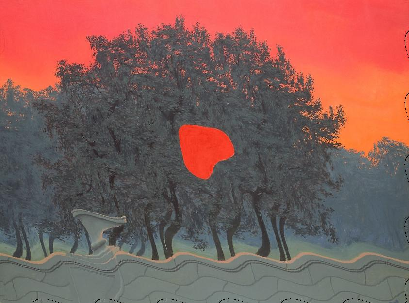

# Glitch Art Tools

Scripts and GUI programs that can be used to make glitch art.  
Not all of it is literal glitch art, but it's all the same style.  

I'll be adding more tools to perform all sorts of glitches, some emulating actual glitches.

## Features

### Pixelsorting

Sort pixels from the image

### Line Offsets

Rotate lines by some amount or by using sine and cosine

### Line Offsets With Aura
Same as regular line offsets but the rotated image is overlayed on top of the original with less opacity.

### Swizzling / Channel Swapping

Swap RGB of pixels....
I call it swizzling in reference to OpenGL [Swizzling](https://www.khronos.org/opengl/wiki/Data_Type_(GLSL)#Swizzling)

## Requirements
- Python 3.6+
- PySide6
- Pillow (PIL)

